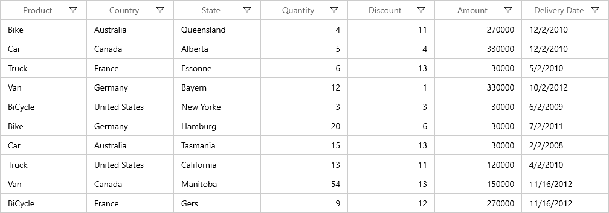
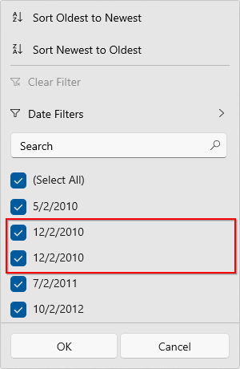
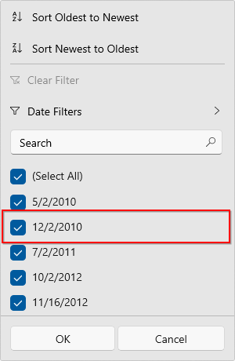
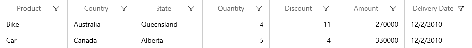

# How to filter the records based on display text in WinUI DataGrid?

## About the sample

This example describes how to filter the records based on display text in WinUI DataGrid.

When Advanced Filtering is used in the [WinUI DataGrid](https://www.syncfusion.com/winui-controls/datagrid) (SfDataGrid), records are filtered based on the actual value, by default. To filter records based on the [DisplayText](https://help.syncfusion.com/cr/winui/Syncfusion.UI.Xaml.Data.ColumnFilter.html#Syncfusion_UI_Xaml_Data_ColumnFilter_DisplayText), use the [ColumnFilter](https://help.syncfusion.com/cr/winui/Syncfusion.UI.Xaml.DataGrid.GridColumn.html#Syncfusion_UI_Xaml_DataGrid_GridColumn_ColumnFilter) property in the corresponding column.

In the following grid, the first and second records have the same display value for the Delivery Date column, but the actual values differ (12/02/2010 10:50:23 AM and 12/02/2010 7:30:22 PM). 



Filtering is applied based on the actual value. So, both values are considered to be different. On opening the filter popup, both values are displayed and seems similar as seen in the following screenshot. 



Only the display value is considered for filtering when the ColumnFilter is DisplayText. The following code example shows how to set the ColumnFilter for a particular column.

``` XML

<syncfusion:GridDateColumn HeaderText="Delivery Date" MappingName="DeliveryDate" ColumnFilter="DisplayText"  />

```

When the ColumnFilter is DisplayText, filter popup is shown as follows, 



After filtering, both the records having the same DisplayText in DeliveryDate column will be displayed like below screenshot.



Take a moment to peruse the [WinUI DataGrid - Filtering](https://help.syncfusion.com/winui/datagrid/filtering) documentation, where you can find about filtering with code examples.

## Requirements to run the demo
Visual Studio 2019 and above versions
